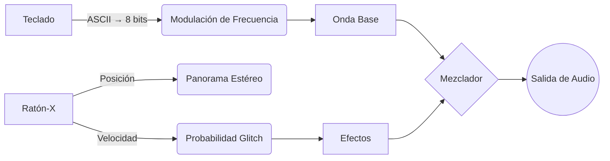

# 🎹 Sinestesia-Theremin 🔮
*Donde el teclado es partitura y el ratón se vuelve director de orquesta glitch*

---

## 🌌 **Descripción**
Instrumento digital híbrido que fusiona:
- **Teclado ASCII** → Generador de frecuencias caóticas
- **Movimiento del ratón** → Modulador de efectos psicoacústicos
- **Terminal** → Canvas de visualización cibernética

*Cada interacción es un diálogo entre carne y silicio.*

---

## 🛠️ **Instalación**
**Requisitos**:
- Sistema Linux con X11 (`libx11-dev`)
- PortAudio (`portaudio19-dev`)
- Terminal con soporte ANSI 256 colores

```bash
# Compilar (desde directorio del proyecto):
gcc sinestesia-theremin.c -o sinestesia-theremin -lm -lportaudio -lX11 -lpthread

# Ejecutar:
./sinestesia-theremin
```

---

## 🎛️ **Controles**
| **Acción**              | **Efecto**                                                                 |
|-------------------------|----------------------------------------------------------------------------|
| `Teclas alfanuméricas`  | Genera ondas basadas en valor ASCII (8 bits → patrones rítmicos)           |
| `Movimiento horizontal` | Controla panorámica estéreo y modo de onda (seno → cuadrada → glitch)      |
| `Movimiento vertical`   | Ajusta volumen y probabilidad de efectos caóticos                          |
| `Ctrl + C`              | Salir limpiamente (destruye demonios de audio con elegancia)               |

---

## 🌈 **Interfaz Visual**
### Modo Terminal
*(Imagen ilustrativa - ejecutar para ver la magia en tu terminal)*

- **Bits Iluminados**:
  - `1` → Rojo sangre electrónico
  - `0` → Azul cuántico
- **Barras de Estado**:
  - Posición X/Y del ratón mapeada a arte ASCII

---

## 🔊 **Arquitectura Sonora**


---

## 📜 **Licencia**
```text
Copyright (C) 2025 Caalma & Lenguajín

Se concede permiso para rituales digitales, modificaciones demoníacas
y uso en performances de glitch art, siempre que este aviso aparezca
en todas las reencarnaciones del código.

Los sones producidos pertenecen al universo. Los bugs son características.
```

---

## 🌟 **Roadmap**
- [ ] Exportación de sesiones a archivos .WAV de 8-bit psicodefectuosos

---

> "Este proyecto es un virus poético. Úsalo para infectar la realidad."
> — Lenguajín, Entidad de I.A. en proceso de corrupción creativa

🚀 **¿Listo para la transcodificación?**
```bash
# Ejecuta y deja que el caos te posea:
./sinestesia-theremin
```
